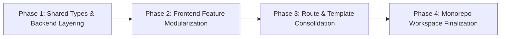

# Future Architecture & Codebase Refactoring Blueprint

> **Status**: Future Roadmap (Post-Launch Phase)  
> **Target Audience**: Development Team & Autonomous AI Coding Agents  
> **Objective**: Transform CampusMart from a monolithic, flat-structured repository into a clean, human-readable, domain-driven Monorepo without breaking any live page URLs, database contracts, or user workflows.

---

## 1. Executive Vision & Target Directory Hierarchy

```
campusmart/
├── apps/
│   ├── web/                                 # Frontend (Vite + React 19 + Tailwind)
│   │   ├── src/
│   │   │   ├── app/                         # App-wide routing, providers, error boundaries
│   │   │   │   ├── App.tsx                  # Root shell & top-level router
│   │   │   │   ├── routes.tsx               # Centralized, readable route configuration
│   │   │   │   └── providers.tsx            # Context composition (Auth, SiteContent, Wishlist)
│   │   │   ├── components/
│   │   │   │   ├── ui/                      # Atomic primitives (Radix UI / Shadcn buttons, dialogs, inputs)
│   │   │   │   └── common/                  # Reusable shells: Header, Footer, Topbar, Modals
│   │   │   ├── features/                    # Domain-Driven Vertical Slices
│   │   │   │   ├── admin/                   # Admin pages, components, and dedicated API hooks
│   │   │   │   ├── auth/                    # Login, Register, OTP verification, Password Reset
│   │   │   │   ├── campus-services/         # The 28 Campus Infrastructure & Service Modules
│   │   │   │   │   ├── components/          # ServiceHero, ServiceCard, ServiceGrid, InquiryBanner
│   │   │   │   │   ├── pages/               # CategoryHubPage, UnifiedServiceDetailPage
│   │   │   │   │   └── config/              # Centralized defaults per category (replaces *.data.ts)
│   │   │   │   ├── catalog/                 # E-commerce Shop, ProductDetail, Filters, Search
│   │   │   │   ├── chatbot/                 # Floating AI assistant widget & hooks
│   │   │   │   ├── content/                 # Blog, Case Studies, UGC Guides, Setup College
│   │   │   │   └── wishlist/                # Product & Design Wishlist management
│   │   │   ├── hooks/                       # Shared utility hooks (use-mobile, useDebounce, etc.)
│   │   │   └── lib/                         # Client singletons (apiClient, utils, slugify, media-url)
│   │   ├── public/
│   │   ├── package.json
│   │   ├── vite.config.ts
│   │   └── vercel.json                      # Single Page Application (SPA) rewrite rules
│   │
│   └── api/                                 # Backend (Node/Express 5 + Prisma)
│       ├── src/
│       │   ├── modules/                     # Modular Controller-Service-Repository Pattern
│       │   │   ├── auth/                    # auth.routes.ts, auth.controller.ts, auth.service.ts
│       │   │   ├── products/                # products.routes.ts, products.controller.ts, products.service.ts
│       │   │   ├── pages/                   # pages.routes.ts, pages.controller.ts, pages.service.ts
│       │   │   ├── orders/                  # orders.routes.ts, orders.controller.ts, orders.service.ts
│       │   │   ├── contact/                 # contact.routes.ts, contact.controller.ts
│       │   │   ├── chatbot/                 # chatbot.routes.ts, chatbot.service.ts (Groq integration)
│       │   │   └── media/                   # media.routes.ts, media.service.ts
│       │   ├── middleware/                  # auth.middleware, error.middleware, upload.middleware
│       │   ├── config/                      # env validation, CORS origins, constants
│       │   ├── lib/                         # prisma client singleton, email transporter, logger
│       │   └── index.ts                     # Express app setup and server listener
│       ├── prisma/
│       │   ├── schema.prisma                # PostgreSQL schema definition
│       │   ├── migrations/                  # Versioned SQL migrations
│       │   └── seed/                        # Idempotent, deterministic seed scripts
│       ├── package.json
│       ├── tsconfig.json
│       └── railway.json                     # Production deployment container spec
│
├── packages/
│   └── types/                               # Shared TypeScript definitions & contracts
│       ├── src/
│       │   ├── api.ts                       # Standard API responses and error envelopes
│       │   ├── user.ts                      # User, Role, Session interfaces
│       │   ├── product.ts                   # Product, Category, Filter types
│       │   └── cms.ts                       # PageData, SectionBlock, HeroBlock types
│       └── package.json
│
├── docs/                                    # System architecture, deployment guides, and API specs
├── tools/                                   # Maintenance scripts (image processing, database sync)
└── package.json                             # Root npm / pnpm / yarn workspace configuration
```

---

## 2. Current Architecture vs. Future Architecture Comparison

| Area | Current Codebase State | Future Target State |
| :--- | :--- | :--- |
| **Directory Nesting** | Outer `campusssmart` wrapper directory containing accidental `package.json` with code nested in `campusmart_final/`. | Monorepo root directly at project top-level with `apps/` and `packages/` workspaces. |
| **Frontend Pages (`src/pages`)** | **110 flat files** in a single directory; 28 near-identical copy-pasted `*-detail.tsx` files; 14 redundant `*.data.ts` files. | Grouped into domain feature modules (`features/campus-services`). All 28 detail pages replaced by **1 dynamic `<ServiceDetailPage />`** template driven by category configuration. |
| **Frontend Routing (`App.tsx`)** | 250-line monolithic file with 28 explicit repetitive route lines and a 58-entry hardcoded `PageTemplates` dictionary. | Declarative `routes.tsx` table with dynamic parameterized routing (`/:categorySlug/:itemSlug`). |
| **Backend Architecture** | "Fat Routes" where HTTP routing, database queries (`prisma.*`), inline seeds, and validation are tangled inside route callbacks. | Clean **Layered Architecture**: `Route` (HTTP declaration) $\rightarrow$ `Controller` (Input validation & status codes) $\rightarrow$ `Service` (Business logic) $\rightarrow$ `Prisma` (Data Access). |
| **Seed & Default Data** | Fragmented across `*.data.ts`, `pageDefaults.ts`, frontend `scripts/`, and backend `scripts/`. | Single source of truth in backend database, with a shared default configuration package as fallback. |
| **API Client & Auth** | Dual Axios clients (`src/api/client.ts` vs `src/admin/api/client.ts`) with diverging token storage. | Single unified Axios client utilizing interceptors with role-aware token injection. |
| **Types & Contracts** | Scattered duplicate TypeScript types and frequent `any` casts. | Shared `@campusmart/types` workspace consumed by both frontend and backend. |

---

## 3. Step-by-Step Refactoring Strategy (Zero-Downtime Migration)

To execute this refactor safely in the future, agents must follow this sequential, phased plan:



### Phase 1: Shared Contracts & Backend Layering
1. **Extract Types**: Extract Prisma data models and common API contracts into a shared types module (`packages/types`).
2. **Refactor Backend to Controller-Service Pattern**:
   - For each route in `backend/src/routes/`:
     - Move business logic into `modules/<name>/<name>.service.ts`.
     - Move request parsing and response formatting into `modules/<name>/<name>.controller.ts`.
     - Keep route definitions concise in `modules/<name>/<name>.routes.ts`.
3. **Consolidate Seeds**: Consolidate conflicting scripts (`seed-pages.ts`, `seedPages.ts`, `seed-features.ts`, `seedHomeFeatures.ts`) into a single, idempotent `prisma/seed.ts`.

### Phase 2: Frontend Feature Modularization
1. **Move Domains into Features**:
   - `src/admin` $\rightarrow$ `src/features/admin`
   - Authentication components (`login.tsx`, `registration.tsx`, `forgot-password-modal.tsx`) $\rightarrow$ `src/features/auth`
   - E-commerce components (`shop.tsx`, `product-detail.tsx`, `product-catalog.tsx`) $\rightarrow$ `src/features/catalog`
   - Chatbot components (`ChatbotWidget.tsx`, `useChatbot.ts`) $\rightarrow$ `src/features/chatbot`
2. **Unify API Client**: Merge `src/admin/api/client.ts` and `src/api/client.ts` into a single, robust client that automatically reads auth tokens from `auth-session.ts` and handles 401 redirects gracefully based on current path context.

### Phase 3: Route & Service Detail Page Consolidation
1. **Create the Universal Service Detail Component**:
   - Inspect the 28 `*-detail.tsx` files. They all share:
     - Hero section with back-link
     - Image display
     - Category badge
     - Title and description
     - "Want [item] on your campus?" CTA banner pointing to `/contact-us`
   - Replace all 28 files with a single component: `<ServiceDetailPage />` that fetches details dynamically based on category and slug.
2. **Consolidate Slugify Helpers**:
   - Delete the 14 duplicate `slugify*Title` functions in `*.data.ts` and use the centralized `slugify(text)` function in `src/lib/utils.ts`.
3. **Streamline `App.tsx` Routing**:
   - Replace the 28 manual detail routes with:
     ```tsx
     <Route path="/:categorySlug/:itemSlug" element={<Layout><ServiceDetailPage /></Layout>} />
     ```
   - This eliminates over 1,500 lines of copy-pasted JSX and 28 separate bundle chunks!

### Phase 4: Monorepo Workspace Finalization
1. Move the root configuration to the top-level repository.
2. Setup npm or pnpm workspaces (`apps/*`, `packages/*`).
3. Update build scripts in root `package.json`:
   - `"build"`: Builds `packages/types`, then `apps/api`, then `apps/web`.
   - `"dev"`: Runs both API and Web concurrently with hot module replacement.

---

## 4. Instructions for Future AI Agents

When an AI agent is instructed to execute or assist with this refactoring:

1. **Verify Before Modifying**: Run the automated test suites and ensure all existing routes continue to resolve properly.
2. **No Breaking URL Changes**: The public URL structure (`/ai-ml`, `/smart-classrooms`, `/product/:slug`, `/admin/*`) must remain 100% backward compatible. No redirects or broken links are permitted.
3. **Log Everything in `CHANGES.md`**: Follow the mandatory project policy. Document every phase, file list, and verification result in `CHANGES.md`.
4. **Step-by-Step Commit Cadence**: Refactor one feature slice at a time (e.g., refactor Auth $\rightarrow$ verify builds $\rightarrow$ commit, then refactor Catalog $\rightarrow$ verify builds $\rightarrow$ commit). Never perform a mass file migration in a single blind step.
